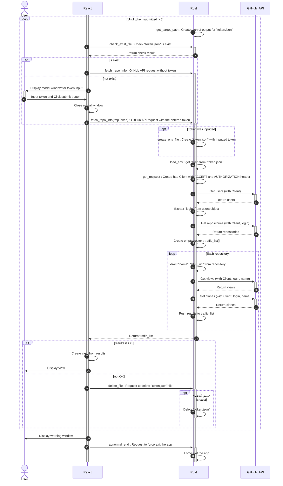

```mermaid
sequenceDiagram
  autonumber
  actor User
  participant React
  participant Rust
  participant G as GitHub_API

  activate React
  activate Rust

 loop Until token submitted > 5
    Rust->>Rust : get_target_path : Create path of output for "token.json"
    React->>+Rust : check_exist_file : Check "token.json" is exist
    Rust-->>-React : Return check result
    alt is exist
      React->>+Rust : fetch_repo_info : GitHub API request without token
    else not exist
     React->>+User : Display modal window for token input
     User->>-React : Input token and Click submit button
     React->>React : Close modal window
     React->>+Rust : fetch_repo_info{tmpToken} : GitHub API request with the entered token
    end
    opt Token was inputted
      Rust->>Rust : create_env_file : Create "token.json" with inputted token
    end
    Rust->>Rust : load_env : get token from "token.json"
    Rust->>Rust : get_reqwest : Create http Client with ACCEPT and AUTHORIZATION header
    Rust->>+G : Get users (with Client)
    G-->>-Rust : Return users
    Rust->>Rust : Extract "login" from users object
    Rust->>+G : Get repositories (with Client, login)
    G-->>-Rust : Return repositories
    Rust->>Rust : Create empty vector : traffic_list[]
    loop Each repository
      Rust->>Rust : Extract "name", "html_url" from repository
      Rust->>+G : Get views (with Client, login, name)
      G-->>-Rust : Return views
      Rust->>+G : Get clones (with Client, login, name)
      G-->>-Rust : Return clones
      Rust->>Rust : Push results to traffic_list
    end
    Rust-->>-React : Return traffic_list
    alt results is OK
      React->>React : Create view from results
      React->>User : Display view
    else not OK
      React->>+Rust : delete_file : Request to delete "token.json" file
      opt : "token.json" is exist
      Rust->>-Rust : Delete "token.json"
      end
    end
 end
 React->>User : Display warning window
 React->>+Rust : abnormal_end : Request to force exit the app
 Rust->>-Rust : Force exit the app

 deactivate React
 deactivate Rust
```
