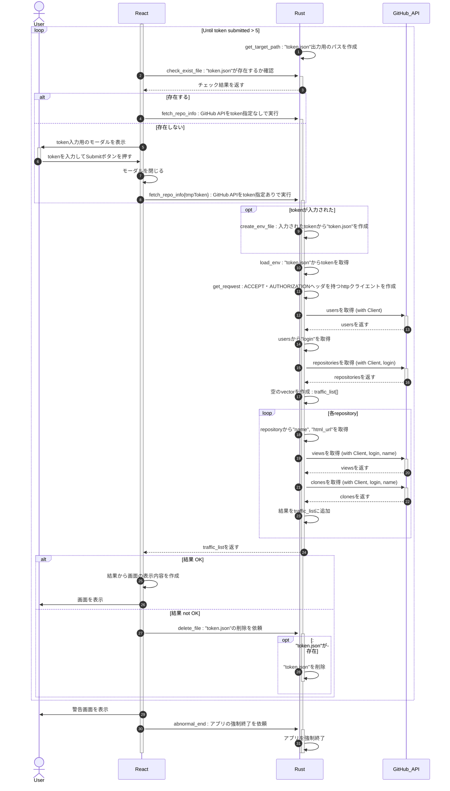

```mermaid
sequenceDiagram
  autonumber
  actor User
  participant React
  participant Rust
  participant G as GitHub_API

  activate React
  activate Rust

 loop Until token submitted > 5
    Rust->>Rust : get_target_path : "token.json"出力用のパスを作成
    React->>+Rust : check_exist_file : "token.json"が存在するか確認
    Rust-->>-React : チェック結果を返す
    alt 存在する
      React->>+Rust : fetch_repo_info : GitHub APIをtoken指定なしで実行
    else 存在しない
     React->>+User : token入力用のモーダルを表示
     User->>-React : tokenを入力してSubmitボタンを押す
     React->>React : モーダルを閉じる
     React->>+Rust : fetch_repo_info{tmpToken} : GitHub APIをtoken指定ありで実行
    end
    opt tokenが入力された
      Rust->>Rust : create_env_file : 入力されたtokenから"token.json"を作成
    end
    Rust->>Rust : load_env : "token.json"からtokenを取得
    Rust->>Rust : get_reqwest : ACCEPT・AUTHORIZATIONヘッダを持つhttpクライエントを作成
    Rust->>+G : usersを取得 (with Client)
    G-->>-Rust : usersを返す
    Rust->>Rust : usersから"login"を取得
    Rust->>+G : repositoriesを取得 (with Client, login)
    G-->>-Rust : repositoriesを返す
    Rust->>Rust : 空のvectorを作成 : traffic_list[]
    loop 各repository
      Rust->>Rust : repositoryから"name", "html_url"を取得
      Rust->>+G : viewsを取得 (with Client, login, name)
      G-->>-Rust : viewsを返す
      Rust->>+G : clonesを取得 (with Client, login, name)
      G-->>-Rust : clonesを返す
      Rust->>Rust : 結果をtraffic_listに追加
    end
    Rust-->>-React : traffic_listを返す
    alt 結果 OK
      React->>React : 結果から画面の表示内容を作成
      React->>User : 画面を表示
    else 結果 not OK
      React->>+Rust : delete_file : "token.json"の削除を依頼
      opt : "token.json"が存在
      Rust->>-Rust : "token.json"を削除
      end
    end
 end
 React->>User : 警告画面を表示
 React->>+Rust : abnormal_end : アプリの強制終了を依頼
 Rust->>-Rust : アプリを強制終了

 deactivate React
 deactivate Rust
```
